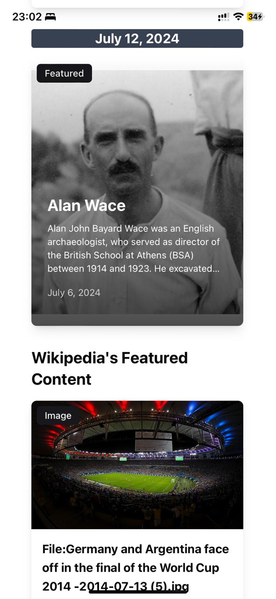

# Wikidiscover

Wikidiscover is a tool to help you discover new Wikipedia articles based on your interests.

Frontend: [https://wikidiscover.fly.dev/](https://wikidiscover.fly.dev/)  
Backend: [https://backend-wikidiscover.fly.dev/](https://backend-wikidiscover.fly.dev/)  
LibreTranslate: [https://libretranslate-wikidiscover.fly.dev/](https://libretranslate-wikidiscover.fly.dev/)

## Setup

### Prerequisites

- Node.js
- Docker

### Running the project

To run the project locally, follow these steps:

```bash
npm run dev
```

This will start the frontend and backend servers together with a LibreTranslate and a Redis server.


## Architecture

The project is divided into main parts:

1. Frontend: ReactJS with Vite
2. Backend: Node.js API with NestJS
3. Mobile App: Capacitor
4. LibreTranslate API
5. Redis

The frontend and backend are deployed to Fly.io. Upstash is used for the Redis.

## CI/CD integration

This project uses GitHub Actions for CI/CD. The frontend and backend are deployed to Fly.io. The LibreTranslate API has also been deployed to Fly.io.

- [x] Automated tests
- [x] Automated deployment to Fly.io
- [x] Preview deployment per pull request
- [x] Production is deployed on merge to main

## Development principles

- Explicit is better than implicit
- Separate concerns
- TDD
- Type safety - no `any`
- Always return a result from actions that can fail

### Frontend: ReactJS

The frontend is a TypeScript ReactJS app with Vite as the build tool. It displays a grid of cards from the [Wikipedia Featured Content API](https://api.wikimedia.org/wiki/Feed_API/Reference/Featured_content).

This app loads content in the [300+ languages](https://api.wikimedia.org/wiki/Feed_API/Language_support) supported by Wikipedia. More details are in the backend section and how it leverages the LibreTranslate API.

It loads the selected date's feature article in the selected language. If, however, the article is not available in the selected language, it will be translated using the [LibreTranslate API](https://libretranslate.com/).

If the article is not available, it will show the featured image, the "In the news" content, or the most-read article of the day.

All the labels in the app are translated to the selected language. If LibreTranslate does not support the selected language, the app will default to English.

The app loads more content as you scroll down the page.

#### User Interface

- [x] UI elements for date selection
- [x] UI elements for language selection
- [x] Fetch and display content based on selections
- [x] Infinite scrolling
- [x] Loading screen while fetching data
- [x] Error screen for errors

#### Card Content

- [x] Display title
- [x] Display thumbnail (if available)
- [x] Display brief description
- [x] Display views count for most-read articles
- [x] Display date for the featured content

### Interaction

- [x] Open content in a new tab on card click
- [x] Mark clicked cards as read with a visual indicator
- [x] Persist 'read' status in local storage

## Backend: Node.js API with NestJS using TypeScript

The backend is a proxy for the Wikipedia Featured Content API. It also offers seamless translation for the featured content via the LibreTranslate API. It translates all the labels used in the app to the selected language.

The backend also has a Redis cache for the response from the Wikipedia API to reduce the number of requests to the Wikipedia API.

Wikipedia Featured Content returns the following types of content:

- Daily featured article
- In the news
- On this day in history
- Daily featured image
- Most-read articles (300+ languages supported)

However, not all content is available in all languages. Only the most-read article is available in all languages. This is where the LibreTranslate API comes in. It translates the content to the selected language.

LibreTranslate deployment has support for [44 languages](https://libretranslate-wikidiscover.fly.dev/docs/#/translate/get_languages) (only two are not available from the libretranslate.com version).

The translation works as follows:

1. If the content is available in the selected language, it is returned as is.
2. If the language is not English and is supported by LibreTranslate:
   - Fetch the English content from Wikipedia, since all the featured content is available in English.
   - If content is not available in the selected language (Featured Article), it will be translated to the target language from English.
   - The same goes for image, news, and on this day content.
3. All the labels used in the app are translated to the selected language. If LibreTranslate does not support the selected language, the app will default to English.

### Features

- [x] `/feed`: Proxy to Wikipedia API, accepts GET requests, validates parameters, standard error response
- [x] Local development and testing environment with Docker and docker-compose
- [x] Use Redis to cache responses from Wikipedia API

# Mobile App

It is a Capacitor app that uses the same codebase as the web app. It is compatible with both Android and iOS.

- [x] Tested the app on iOS



## Missing features

- [] Persists logs using SQLite
- [] E2E testing with Cypress
